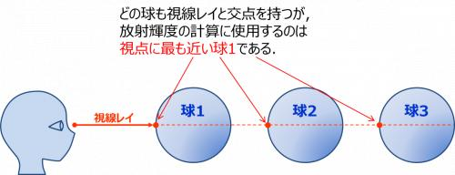

# mini_RT

引数は以下のような感じ
```
A 0.2 255,255,255
C 0,0,0 0,0,1 70
L 0,0,-3 0.6
sp 0,0,10 7 0,0,255
```

-> Camera(C)視点、Light(L)光源からSphere(S)を見る

①open, read, close...などでファイルを受け取って解釈する

②計算して表示

---

Sphereについてはplaygroundのコードを参照
他にPlane（平面）, Cylinder（円筒）の実装が必要

赤色の球の表示はできたが、複数のオブジェクトの表示をするためには、
それぞれをループで回して視点に最も近い物体を使う↓

